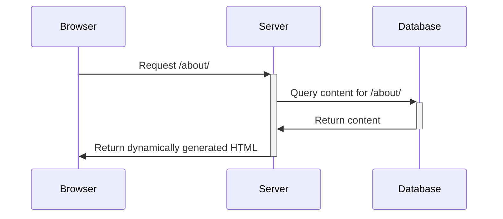
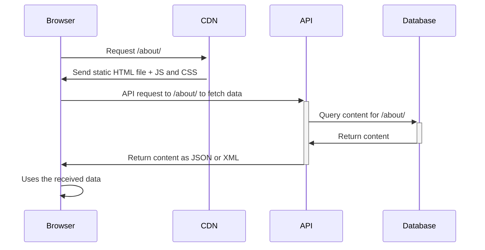
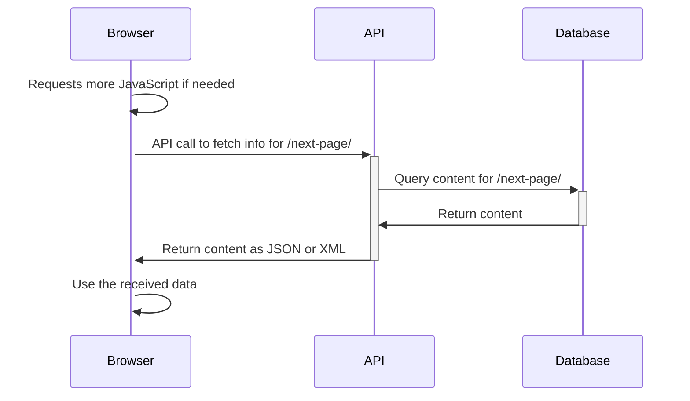

# Status Quo of Server Side Rendering

## for Single Page Applications

### AFT - TU Dresden - 06.04.2023

---
layout: two-cols
heading: About me
---

<template v-slot:default>

  <h2 class="mt-4">Alexander Lichter</h2>

</template>

<template v-slot:right>
<VClicks class="space-y-2 mt-10 text-xl h-full">

* <mdi-account-check class="text-green-100" /> Diplom-Informatik (2015)
* <ic-round-terminal /> Open Source / Web Dev Consultant
* <mdi-twitter class="text-blue-400" /> @TheAlexLichter
* <mdi-web /> [https://lichter.io](https://lichter.io)
* <mdi-github /> [manniL](https://github.com/manniL)

</VClicks>
</template>

---
layout: intro
---

# Web Development changes quickly!

---

* Before we get into SSR, let's have a look at SPAs

* From Static HTML files (back in the days)
* To Dynamic pages rendered via Java, PHP or .NET (or similar) - Multi Page Aplications
* In the last years, we've seen a huge shift towards Single Page Applications (SPAs)
* Both, MPAs and SPAs have their pros and cons
* To get the "best of both worlds", we can use SSR

---

# Agenda

<VClicks depth="2">

1. Taking a look at the two app types: MPAs and SPAs
    * Understand their advantages and disadvantages
1. Exploring rendering concepts
    * Traditional SSR
    * Client Side Rendering
    * Traditional SSR + Progressive Enhancement
    * HTML-centric Rendering
    * Modern SSR / Isomorphic Rendering
1. Subtypes of SSR
    * Dynamic / On the fly
    * Static Site Generation / Prerendering
    * Incremental Static (Re-)Generation

</VClicks>

---

# Multi Page Applications I

<VClicks>

* Most common approach for web development in the past
* Lots of websites are still built this way
* Server renders HTML for each page
* On route changes, the browser does the same thing again

</VClicks>

---

# Single Page Applications I

<VClicks>

* Rather new approach in web development
* Server only serves the initial (almost-empty) HTML file with some JS
* Client-side JavaScript takes over, generates the HTML and updates the DOM
* JavaScript issues API request to get data

</VClicks>

---

# Single Page Applications II

<VClicks>

* When requesting a new page, the browser does not do a full page reload
* Instead, it only updates the content in the DOM, reusing other parts of the page

</VClicks>

---

# Comparison of SPAs and MPAs I

<VClicks depth="2">

* Initial Request
  * <mdi-close class="text-red-500" /> SPA: Loading spinner before seeing content
  * <mdi-check class="text-green-500" /> MPA: Content is visible "immediately"
* Subsequent requests
  * <mdi-check class="text-green-500" /> SPA: No page reload, only changed content is updated. Transitions can be applied
  * <mdi-close class="text-red-500" /> MPA: Full page reload, "click-and-wait"
* Transferred JavaScript
  * <mdi-close class="text-red-500" /> SPA: JavaScript is necessary to render the page
  * <mdi-check class="text-green-500" /> MPA: Does not necessarily need JavaScript to work (only for interactive parts)
  
</VClicks>

---

# Comparison of SPAs and MPAs II

<VClicks depth="2">

* Search Engine Optimization
  * <mdi-close class="text-red-500" /> SPA: Various downsides
  * <mdi-check class="text-green-500" /> MPA: No downsides by default
* Developer Experience and Productivity
  * <mdi-check class="text-green-500" /> SPA: Better DX because of clear separation FE/BE, self-contained application parts, ...
  * <mdi-close class="text-red-500" /> MPA: Worse the more "frontend" logic is needed
* Accessibility
  * <mdi-close class="text-red-500" /> SPA: Needs more caution and extra work
  * <mdi-check class="text-green-500" /> MPA: Fine out of the box
  
</VClicks>

<!--

DX:

* Clear data contracts between API/SPA
* Self-contained application parts
* Easy to transfer the state
* No state management on front and backend
* Clear responsibilities

-->

---

# And the winner is....

---

# There is no clear winner

<VClicks>

* Both, MPAs and SPAs have their pros and cons
* Both are suitable app types to build web applications
* But: What if we could combine the best of both worlds?

</VClicks>

---

---
layout: two-cols
heading: Thank you for your attention!
---

<template v-slot:default>

  <h2 class="mt-4">Alexander Lichter</h2>

</template>

<template v-slot:right>

* <mdi-account-check class="text-green-100" /> Diplom-Informatik (2015)
* <ic-round-terminal /> Open Source / Web Dev Consultant
* <mdi-twitter class="text-blue-400" /> @TheAlexLichter
* <mdi-web /> [https://lichter.io](https://lichter.io)
* <mdi-github /> [manniL](https://github.com/manniL)

</template>

