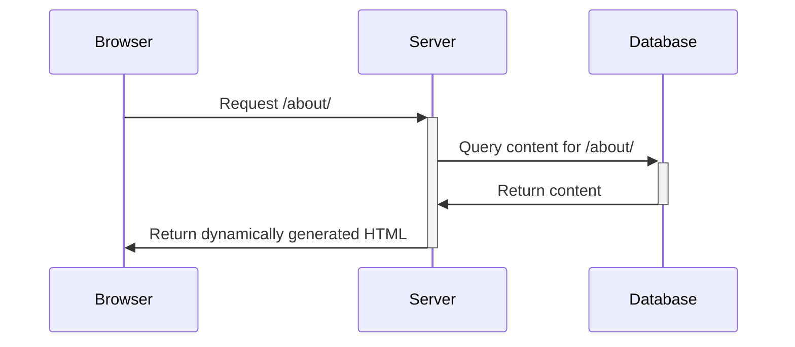
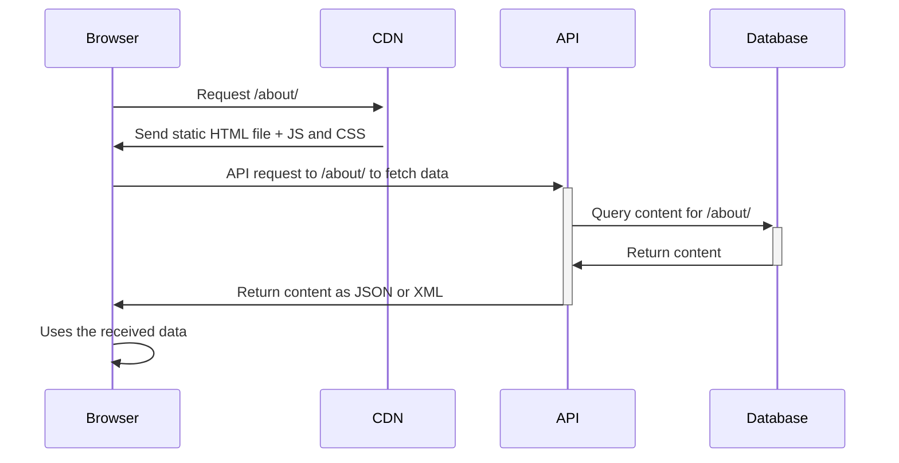
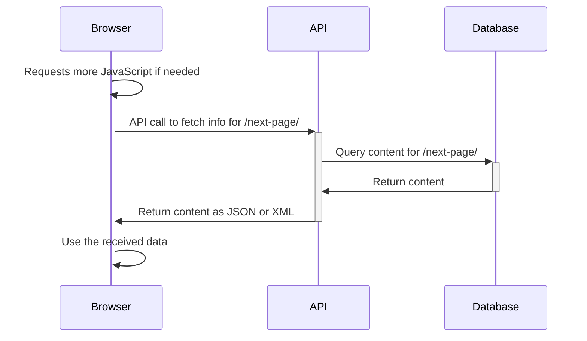
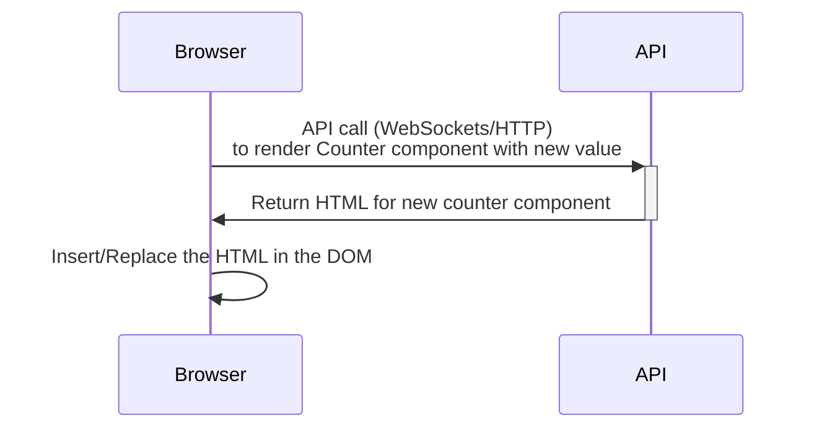
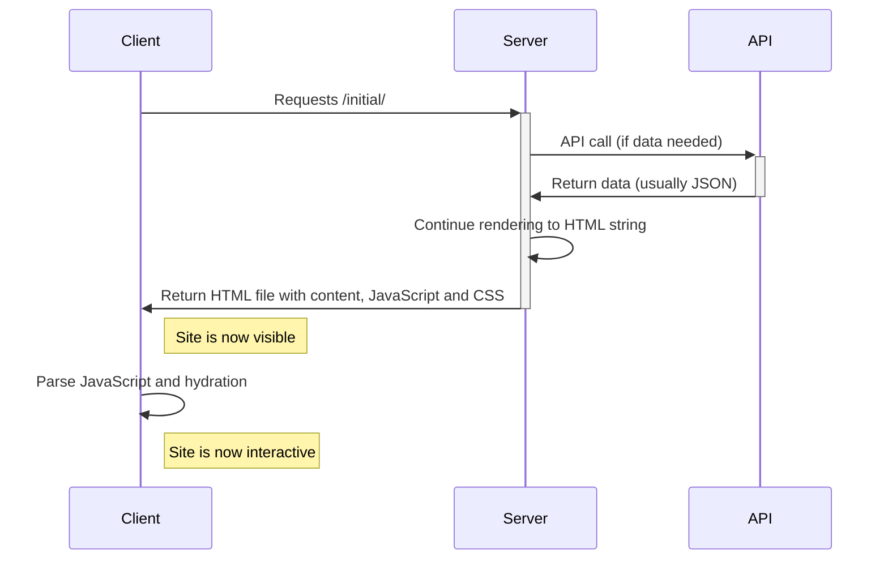
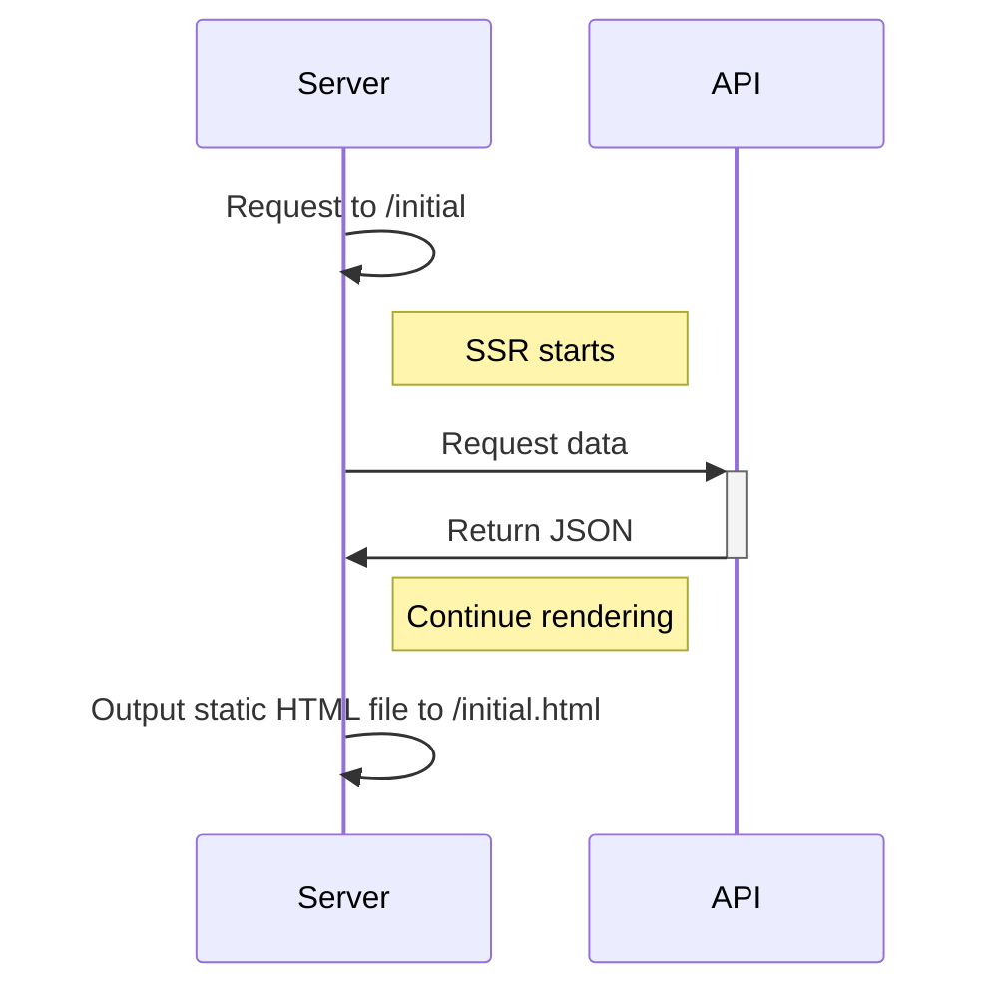
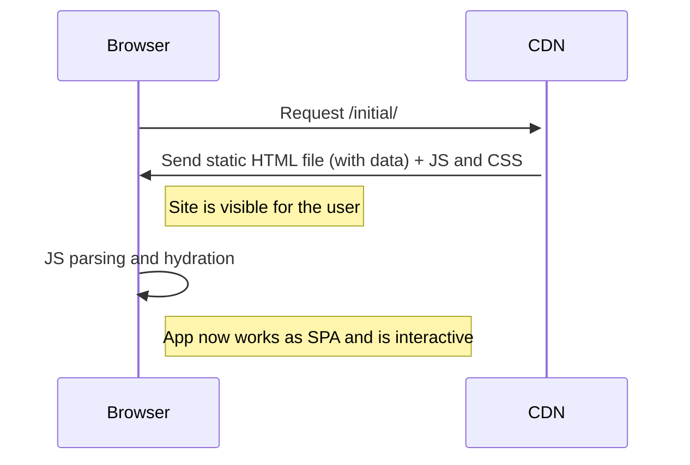
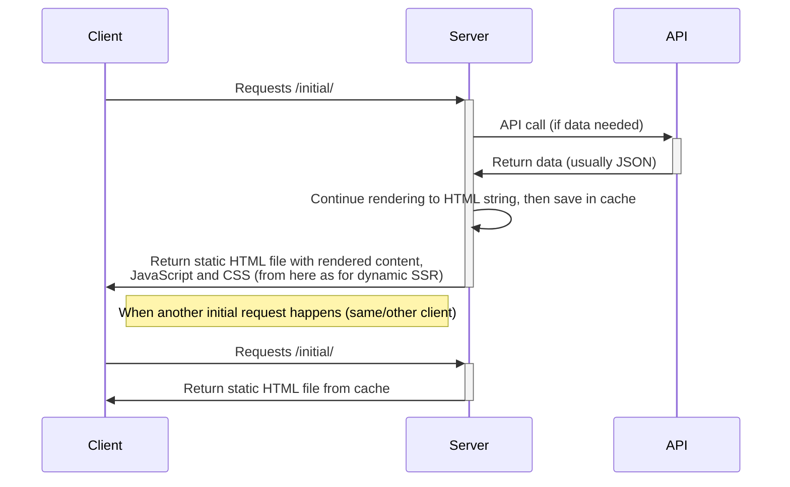

# Status Quo of <span class="text-green-200">Server Side Rendering</span>

## for Single Page Applications

### AFT - TU Dresden - 06.04.2023

<style>
  h1 {
    @apply !text-5xl;
  }

  h2 {
    @apply !text-3xl !mt-16 !mb-32;
  }

  h3 {
    @apply !text-base;
  }
</style>

---
layout: two-cols
heading: About me
---

<template v-slot:default>
<div class="flex flex-col justify-center items-center h-full">

  <h2 class="mt-4">Alexander Lichter</h2>
</div>
</template>

<template v-slot:right>
<VClicks class="space-y-2 mt-10 text-xl h-full">

* <mdi-account-check class="text-green-100" /> Diplom-Informatik (2015)
* <ic-round-terminal /> Open Source / Web Dev Consultant
* <mdi-twitter class="text-blue-400" /> @TheAlexLichter
* <mdi-web /> [https://lichter.io](https://lichter.io)
* <mdi-github /> [manniL](https://github.com/manniL)

</VClicks>
</template>

---
layout: intro
---

# Web Development changes quickly!

---

# Web Development changes quickly!

<VClicks>

* From Static HTML files (back in the days)
* To dynamic pages rendered via Java, PHP or .NET (or similar) - Multi Page Aplications
* In the last years, we've seen a huge shift towards Single Page Applications (SPAs)
* Both, MPAs and SPAs have their pros and cons
* To get the "best of both worlds", we can use different rendering concepts, e.g. SSR

</VClicks>

---

# Agenda

<VClicks depth="2">

1. Taking a look at the two app types: MPAs and SPAs
    * Understand their advantages and disadvantages
1. Exploring rendering concepts
    * Traditional SSR
    * Client Side Rendering
    * Traditional SSR + Progressive Enhancement
    * HTML-centric Rendering
    * Modern SSR / Isomorphic Rendering
1. Subtypes of SSR
    * Dynamic / On the fly
    * Static Site Generation / Prerendering
    * Incremental Static (Re-)Generation

</VClicks>

---

# Multi Page Applications I

<VClicks>

* Most common approach for web development in the past
* Lots of websites are still built this way
* Server renders HTML for each page
* On route changes, the browser does the same thing again

</VClicks>

<div class="flex justify-center" v-click>



</div>

---

# Single Page Applications I

<VClicks>

* Rather new approach in web development
* Server only serves the initial (almost-empty) HTML file with some JS
* Client-side JavaScript takes over, generates the HTML and updates the DOM
* JavaScript issues API request to get data

</VClicks>

<div class="flex justify-center" v-click="2">



</div>

---


# Single Page Applications II

<VClicks>

* When requesting a new page, the browser does not do a full page reload
* Instead, it only updates the content in the DOM, reusing other parts of the page

</VClicks>

<div class="flex justify-center mt-4" v-click="2">



</div>

---

# Comparison of SPAs and MPAs I

<VClicks depth="2">

* Initial Request
  * <mdi-close class="text-red-500" /> SPA: Loading spinner before seeing content
  * <mdi-check class="text-green-500" /> MPA: Content is visible "immediately"
* Subsequent requests
  * <mdi-check class="text-green-500" /> SPA: No page reload, only changed content is updated. Transitions can be applied
  * <mdi-close class="text-red-500" /> MPA: Full page reload, "click-and-wait"
* Transferred JavaScript
  * <mdi-close class="text-red-500" /> SPA: JavaScript is necessary to render the page
  * <mdi-check class="text-green-500" /> MPA: Does not necessarily need JavaScript to work (only for interactive parts)
  
</VClicks>

---

# Comparison of SPAs and MPAs II

<VClicks depth="2">

* Search Engine Optimization
  * <mdi-close class="text-red-500" /> SPA: Various downsides
  * <mdi-check class="text-green-500" /> MPA: No downsides by default
* Developer Experience and Productivity
  * <mdi-check class="text-green-500" /> SPA: Better DX because of clear separation FE/BE, self-contained application parts, ...
  * <mdi-close class="text-red-500" /> MPA: Worse the more "frontend" logic is needed
* Accessibility
  * <mdi-close class="text-red-500" /> SPA: Needs more caution and extra work
  * <mdi-check class="text-green-500" /> MPA: Fine out of the box

</VClicks>

<!--

DX:

* Clear data contracts between API/SPA
* Self-contained application parts
* Easy to transfer the state
* No state management on front and backend
* Clear responsibilities

-->

---

# And the winner is....


---

# There is no clear winner

<VClicks>

* Both, MPAs and SPAs have their pros and cons
* Both are suitable app types to build web applications
* But: What if we could combine the best of both worlds?

</VClicks>

---
layout: intro
---

# Rendering Concepts
Let's have a look!

---

# Rendering Concepts

<VClicks depth="2">

* MPAs
  * Traditional SSR
  * HTML-centric Rendering
  * Traditional SSR + Progressive Enhancement
* SPAs
  * Client Side Rendering
  * Modern SSR / Isomorphic Rendering

</VClicks>

<!-- 

* We know how Traditional SSR and pure Client-Side Rendering works already

-->

---

# HTML-centric rendering

<VClicks depth="2">

* Initial request as for Traditional SSR
* Per interactive components:

</VClicks>

<VClick at="1">



</VClick>

---

# HTML-centric rendering II

* <mdi-check class="text-green-500" /> Little JavaScript needed

<VClicks>

* <mdi-check class="text-green-500" /> Stick to framework/backend model
* <mdi-close class="text-red-500" /> Very new concept
* <mdi-close class="text-red-500" /> No mature ecosystem
* <mdi-close class="text-red-500" /> Not Framework-agnostic
* <mdi-close class="text-red-500" /> JS might be needed eventually

</VClicks>

---

# Traditional SSR + Progressive Enhancement

<VClicks depth="2">

* Request logic stays the same
* On the client side, we use JavaScript to enhance the page, not to render it
* Idea: Provide as many functionalities as possible to as many users as possible
  * Example: Image Slider
  * Option 1: Use JavaScript to fetch the images and render the slider
  * Option 2: Provide the images via server-rendered HTML and use JavaScript to enhance the slider
* Progressive Enhancement would be Option 2
  * <mdi-check class="text-green-500" /> Works without JavaScript
  * <mdi-check class="text-green-500" /> Improves functionalities when the user has JavaScript enabled
* Not only for JavaScript enabled/disabled, (e.g. for low battery / bad connection)
* <mdi-check class="text-green-500" /> Provides great accessibility out of the box (as data will be there)
* <mdi-close class="text-red-500" /> Works best for lighweight frontend applications (not frontend-heavy)

</VClicks>

---

# Modern SSR / Isomorphic Rendering I

<VClicks depth="2">

* Combination of Traditional SSR and Client-Side Rendering
* Initial request as for Traditional SSR
* Subsequent requests work as SPA

</VClicks>

---

<div class="flex justify-center">



</div>

---

# Modern SSR / Isomorphic Rendering II

<VClicks>

* <mdi-check class="text-green-500" /> Stick to framework/language model (SPA)
* <mdi-check class="text-green-500" /> Serve HTML on initial request
* <mdi-check class="text-green-500" /> Only load files/data if needed
* <mdi-check class="text-green-500" /> No "click and wait"
* <mdi-check class="text-green-500" /> Use the full power of the JS ecosystem
* <mdi-close class="text-red-500" /> Setup can be more complex (or support of a framework)
* <mdi-close class="text-red-500" /> High TTFB (if uncached)
* <mdi-close class="text-red-500" /> Adds more complexity (code runs on server and client)
* <mdi-close class="text-red-500" /> Some libraries might not support SSR
* <mdi-close class="text-red-500" /> Hydration is CPU intensive

</VClicks>

---

# Choosing a rendering concept

<VClicks depth="2">

* Lots of options, depends on your use case and app requirements
* When deciding in favor of Traditional SSR, there is no reason to not use the Progressive Enhancement approach
* When considering HTML-centric rendering, be aware of the ecosystem limitations. Also a good pick when you want to avoid JavaScript as much as possible
* Client-side rendering might suffice if you build content behind authentication (e.g. dashboards)
* Modern SSR is a good choice for a big range of applications, from complex web applications to simple landing pages.

</VClicks>

---
layout: intro
---

# SSR Subtypes

Because SSR is a whole family of concepts, let's have a look at the different subtypes!

---

# SSR Subtypes

<VClicks>

* Dynamic / on the fly (seen so far)
* Prerendering / SSG
* Incremental Static (Re-)Generation

</VClicks>

---

# Prerendering / SSG - Build step
Process of generating static HTML files at build time (not at runtime)

<div v-click class="flex justify-center">



</div>

---

# Prerendering / SSG - Initial Request

<div class="flex justify-center">



</div>

---

# Prerendering / SSG - Pros and Cons

<VClicks>

* <mdi-check class="text-green-500" /> Fastest initial request
* <mdi-check class="text-green-500" /> Replaces API calls during SSR with static data
* <mdi-check class="text-green-500" /> No server for frontend needed
* <mdi-close class="text-red-500" /> Needs rebuild for data change
* <mdi-close class="text-red-500" /> Build time proportional to page count

</VClicks>

---

# Incremental Static (Re-)Generation
Evolved from combining dynamic SSR and SSG

<div v-click class="flex justify-center">



</div>


---

# Hybrid

<VClicks>

* Nowadays, mixing the SSR subtypes is supported by frameworks such as Nuxt <logos-nuxt-icon /> or Next.js <logos-nextjs-icon />
* This allows to apply the best-fitting subtype per page and improve UX and performance

</VClicks>

<Code v-click file="nuxt.config.ts">

```js
export default defineNuxtConfig({
  // ...
  routeRules: {
    '/admin/**': { ssr: false },
    '/statistics/**': { swr: 600 },
    '/product/**': { swr: true },
    '/blog/**': { static: true },
    '/': { prerender: true }
  }
})
```

</Code>


---

# Outlook and Conclusion

<VClicks depth="2">

* There are two app types: MPAs and SPAs
* Both have various rendering concepts
* Modern SSR is one of them and a viable choice
* It has big benefits when SEO, Accessibility and Performance are important concerns
* There are still unsolved issues with regards to SSR
    * Reduce/improve Hydration process
    * Waterfalls when requesting data
    * Streaming SSR results (not waiting until string is fully resolved)
* These can be topics for subsequent scientific papers

</VClicks>

---
layout: two-cols
heading: Thank you for your attention!
---

<template v-slot:default>
<div class="flex flex-col justify-center items-center h-full">

  <h2 class="mt-4">Alexander Lichter</h2>
</div>
</template>

<template v-slot:right>

* <mdi-account-check class="text-green-100" /> Diplom-Informatik (2015)
* <ic-round-terminal /> Open Source / Web Dev Consultant
* <mdi-twitter class="text-blue-400" /> @TheAlexLichter
* <mdi-web /> [https://lichter.io](https://lichter.io)
* <mdi-github /> [manniL](https://github.com/manniL)

</template>

<style>
  ul {
    @apply space-y-2 mt-10 text-xl h-full;
  }
</style>

---
layout: image
image: /stage-back.jpg
---

<div class="flex w-full justify-center">


# Q & A Time!

</div>